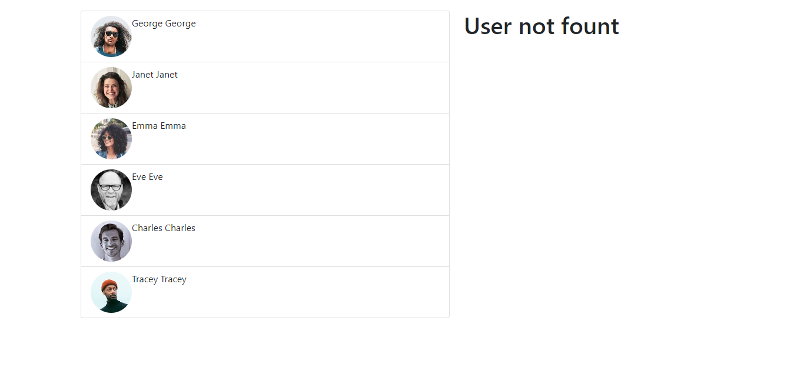

# Usando el hook de react useContext 

Context provee una forma de pasar datos a través del árbol de componentes sin tener que pasar props manualmente en cada nivel.

### Tecnología utilizadas
1. React  ^18.2.0
2. Bootstrap ^5.1.3
3. Axios ^0.27.2

## App hecha con useContext

crea una app que utilaza una api de https://reqres.in que trae 6 usuarios y los muestra en pantalla 

tambien podemos seleccionar un usuario y muestra su destalle

